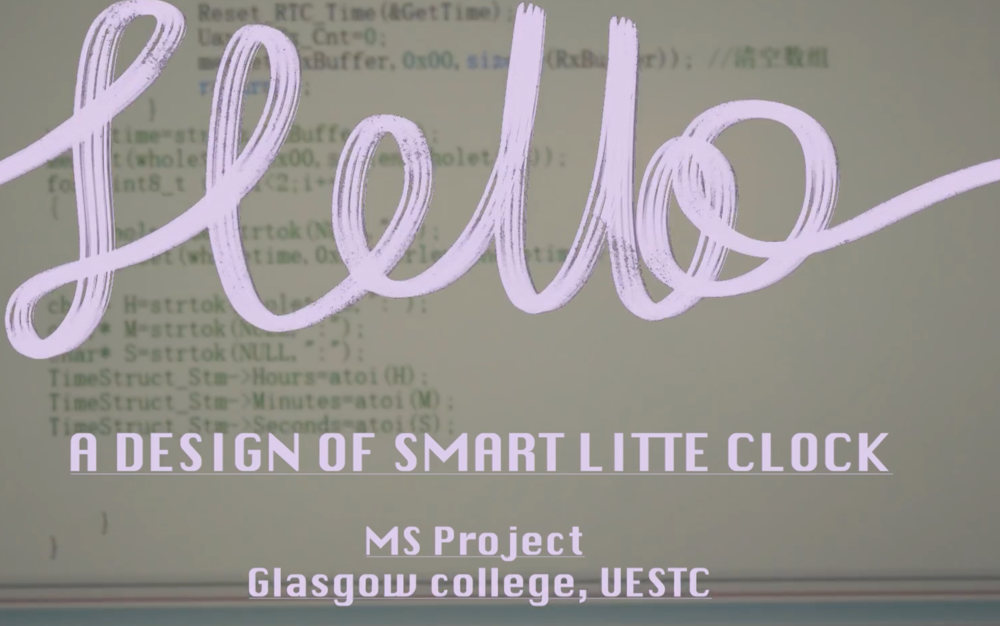

# Little Smart Clock 

这是来自 UoG, UESTC 的 **Lou Xuezhi** 的个人 **Microelectronic Systems** 课程项目仓库

这个仓库服务于 Lou 的 UoG, UESTC 的 **Microelectronic Systems** 的课程项目作业 :rocket: 

本仓库的代号为 **Centaur** :racehorse:

> This is the personal course project repository for Lou Xuezhi from the Glasgow College, University of Electronic Science and Technology of China (UESTC) for the Microelectronic Systems course. This repository serves the course project assignment of Microelectronic Systems at UoG and UESTC. The code name for this repository is Centaur.

本作品是一个**LED智能小钟** :alarm_clock: ，完成了显示时间，调整时间，互联网对时，倒计时，日历等功能. 

> This work is an intelligent LED clock that features functions such as time display, time adjustment, internet time synchronization, countdown, and calendar.

本作品基于 STM HAL库， 利用 CubeMx 进行初始化. 使用的芯片是 STM32 L432KC 和 ESP8266.

> This work is based on the STM HAL library and uses CubeMx for initialization. The chips used are STM32 L432KC and ESP8266.

更多项目细节可以参看 项目介绍视频 :point_right: [**Hello！我做了一个智能小钟 | 格院大一 | MS Project |**](https://www.bilibili.com/video/BV1K47jzDEGw/?spm_id_from=333.1387.favlist.content.click&vd_source=28d8533b0347bef6e0d605b88e99aab0)

> For more project details, please refer to the project introduction video.

本作品使用了无理造物老师 [@AstraThreshold](https://github.com/AstraThreshold) [Astra 基于C的UI框架](https://github.com/AstraThreshold/oled-ui-astra-lite)  特此感谢！ 🎉 :tada: 🎉

> This work uses the C-language-based UI framework developed by [@AstraThreshold](https://github.com/AstraThreshold). I would like to express our special thanks here! 

